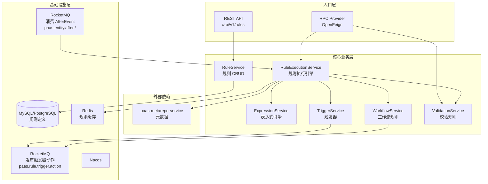
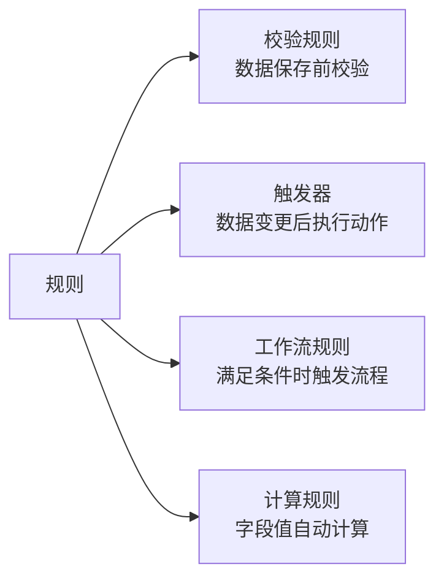
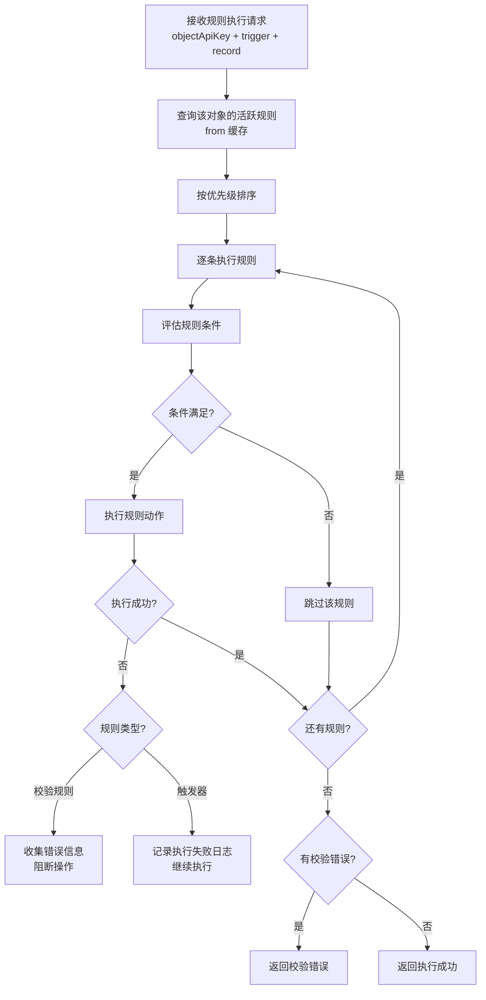
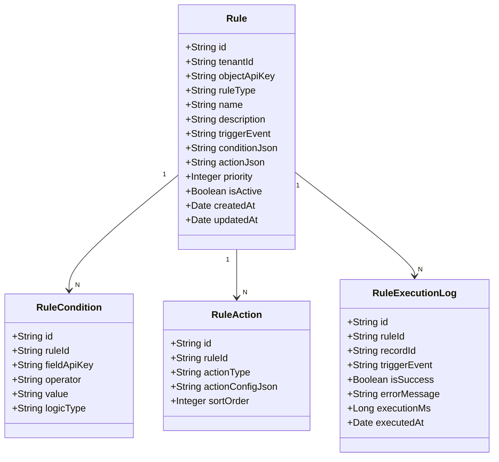
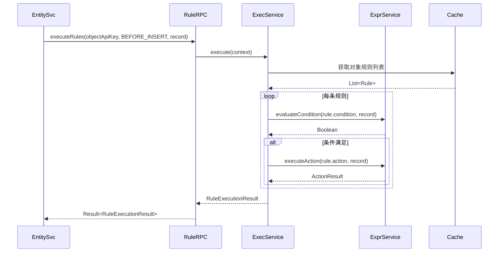
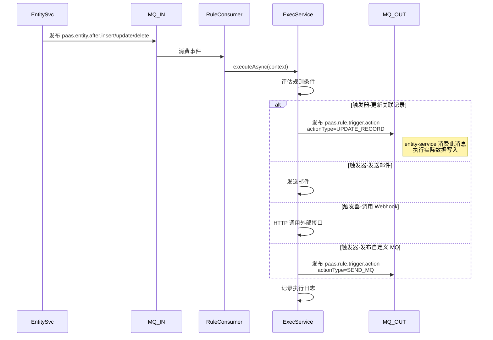

# paas-rule-service 技术设计方案

## 1. 服务概述

规则引擎服务，负责 aPaaS 平台的业务规则定义与执行。支持校验规则、触发器、工作流规则、计算规则四大类型。规则在数据操作的生命周期节点（Before/After）被触发：Before 规则由 entity-service 通过 RPC 同步调用本服务执行；After 规则由 entity-service 发布 MQ 事件，本服务异步消费执行，触发器动作写数据时再发布 MQ 消息由 entity-service 消费，**禁止 rule-service 直接 RPC 调用 entity-service**。

**服务层级：L3 业务层（与 entity-service 同层，禁止同层同步互调）**

---

## 2. 系统架构



---

## 3. 规则类型体系



### 3.1 校验规则（Validation Rule）

在记录保存前执行，不满足条件则阻断保存。

```
示例：当 Status = "Closed Won" 时，Amount 必须大于 0
条件：Status__c = 'Closed Won'
校验：Amount__c > 0
错误提示：金额不能为空
```

### 3.2 触发器（Trigger）

在记录创建/更新/删除后执行自动化动作。

**支持的动作类型：**

| 动作类型 | 说明 |
|---|---|
| `UPDATE_FIELD` | 更新当前记录的字段值 |
| `UPDATE_RELATED` | 更新关联记录的字段值 |
| `CREATE_RECORD` | 创建新记录 |
| `SEND_EMAIL` | 发送邮件通知 |
| `SEND_MQ` | 发布 MQ 消息 |
| `CALL_WEBHOOK` | 调用外部 Webhook |

### 3.3 工作流规则（Workflow Rule）

满足条件时触发工作流，支持审批流、自动化流程。

- 条件评估：记录满足条件时触发
- 触发时机：创建时、更新时、创建或更新时
- 支持延迟执行（如：创建后3天未跟进则发送提醒）

### 3.4 计算规则（Compute Rule）

定义字段值的自动计算逻辑，在记录保存时自动计算。

- 支持四则运算、条件表达式、字符串函数
- 支持跨字段引用（同对象）
- 支持关联对象字段引用（LOOKUP 字段）

---

## 4. 模块职责

### 4.1 RuleService（规则 CRUD）

| 方法 | 说明 |
|---|---|
| `createRule` | 创建规则，解析并验证条件表达式 |
| `updateRule` | 更新规则配置 |
| `deleteRule` | 删除规则 |
| `activateRule` | 启用规则 |
| `deactivateRule` | 停用规则 |
| `listRules` | 查询对象下的规则列表 |
| `debugRule` | 调试规则（用测试数据验证规则逻辑） |

### 4.2 RuleExecutionService（规则执行引擎）

核心执行引擎，按触发时机执行对应规则。

**执行时机：**

| 时机 | 说明 | 同步/异步 |
|---|---|---|
| `BEFORE_INSERT` | 创建前 | 同步（可阻断） |
| `BEFORE_UPDATE` | 更新前 | 同步（可阻断） |
| `BEFORE_DELETE` | 删除前 | 同步（可阻断） |
| `AFTER_INSERT` | 创建后 | 异步 |
| `AFTER_UPDATE` | 更新后 | 异步 |
| `AFTER_DELETE` | 删除后 | 异步 |

**执行流程：**



### 4.3 ExpressionService（表达式引擎）

解析和执行条件表达式与计算表达式。

**支持的表达式语法：**

```
# 条件表达式
Status__c = 'Active' AND Amount__c > 1000
ISPICKVAL(Status__c, 'Closed Won')
NOT ISBLANK(Email__c)

# 计算表达式
Amount__c * Quantity__c
IF(Status__c = 'Active', 'Y', 'N')
TEXT(CreatedDate__c, 'yyyy-MM-dd')
UPPER(Name__c)
```

**内置函数库：**

| 类别 | 函数 |
|---|---|
| 逻辑 | `IF`, `AND`, `OR`, `NOT`, `CASE` |
| 文本 | `TEXT`, `UPPER`, `LOWER`, `LEFT`, `RIGHT`, `LEN`, `CONTAINS` |
| 数值 | `ABS`, `ROUND`, `FLOOR`, `CEILING`, `MAX`, `MIN` |
| 日期 | `TODAY`, `NOW`, `DATEVALUE`, `YEAR`, `MONTH`, `DAY` |
| 判断 | `ISBLANK`, `ISNULL`, `ISPICKVAL`, `INCLUDES` |

---

## 5. 数据模型



**conditionJson 示例：**
```json
{
  "logic": "AND",
  "conditions": [
    { "field": "Status__c", "operator": "EQUALS", "value": "Active" },
    { "field": "Amount__c", "operator": "GREATER_THAN", "value": "1000" }
  ]
}
```

**actionJson 示例（触发器-更新字段）：**
```json
{
  "actionType": "UPDATE_FIELD",
  "updates": [
    { "field": "LastFollowUpDate__c", "value": "TODAY()" },
    { "field": "FollowUpCount__c", "value": "FollowUpCount__c + 1" }
  ]
}
```

---

## 6. 核心流程

### 6.1 同步规则执行（Before 时机）



### 6.2 异步规则执行（After 时机）



**关键约束：rule-service 触发器动作涉及数据写入时，必须通过 MQ 异步通知 entity-service 执行，禁止 RPC 直调 entity-service（同层禁止同步互调）。**

---

## 7. 接口设计

### 7.1 REST 接口

| 方法 | 路径 | 说明 |
|---|---|---|
| POST | `/api/v1/rules` | 创建规则 |
| PUT | `/api/v1/rules/{id}` | 更新规则 |
| DELETE | `/api/v1/rules/{id}` | 删除规则 |
| PUT | `/api/v1/rules/{id}/activate` | 启用规则 |
| PUT | `/api/v1/rules/{id}/deactivate` | 停用规则 |
| GET | `/api/v1/rules` | 查询规则列表 |
| POST | `/api/v1/rules/{id}/debug` | 调试规则 |
| GET | `/api/v1/rules/{id}/logs` | 查询执行日志 |

### 7.2 RPC 接口（core module）

```java
@FeignClient(name = "paas-rule-service")
public interface RuleApi {
    // 执行 Before 规则（同步，可阻断）
    Result<RuleExecutionResult> executeBeforeRules(
        String tenantId,
        String objectApiKey,
        String triggerEvent,
        Map<String, Object> record,
        Map<String, Object> oldRecord
    );

    // 触发 After 规则（异步，不阻断）
    Result<Void> triggerAfterRules(
        String tenantId,
        String objectApiKey,
        String triggerEvent,
        String recordId
    );

    // 校验规则（仅执行 Validation 类型）
    Result<List<ValidationError>> validateRecord(
        String tenantId,
        String objectApiKey,
        Map<String, Object> record
    );
}
```

**RuleExecutionResult 结构：**
```java
public class RuleExecutionResult {
    private boolean blocked;                    // 是否被阻断
    private List<ValidationError> errors;       // 校验错误列表
    private Map<String, Object> fieldUpdates;   // 计算规则产生的字段更新
}
```

---

## 8. 缓存策略

| 缓存 Key | 内容 | TTL | 失效时机 |
|---|---|---|---|
| `rule:{tenantId}:{objectApiKey}:{event}` | 规则列表 | 10min | 规则变更 |
| `rule:expr:{ruleId}` | 编译后的表达式 | 60min | 规则变更 |

---

## 9. 防无限循环设计

触发器执行时可能触发新的数据变更，进而再次触发规则，形成无限循环。

**防护机制：**
- 执行上下文中记录当前调用深度（`ruleDepth`）
- 最大递归深度限制为 5 层
- 超过限制时停止执行并记录告警日志
- 同一条规则在同一次请求链中只执行一次（幂等标记）

---

## 10. 异常处理

| 异常场景 | 处理策略 |
|---|---|
| 表达式语法错误 | 创建规则时校验，返回详细错误位置 |
| 规则执行超时（>500ms） | 中断执行，记录超时日志，After 规则不影响主流程 |
| 触发器动作失败 | 记录失败日志，支持手动重试，不影响原始操作 |
| 规则无限循环 | 超过深度限制后停止，告警通知 |
| 引用字段不存在 | 规则执行时跳过该规则，记录警告日志 |


---

## 11. 数据存储说明

rule-service **不直接维护独立的业务数据库表**。规则定义（校验规则、触发器、工作流规则等）存储在 `paas-metarepo-service` 的 `xsy_metarepo` schema 中，对应 `p_custom_check_rule`、`bpm_proc_template` 等表，通过 metarepo 的 RPC 接口读写。规则执行日志等运行时数据可写入独立的轻量级日志库。


